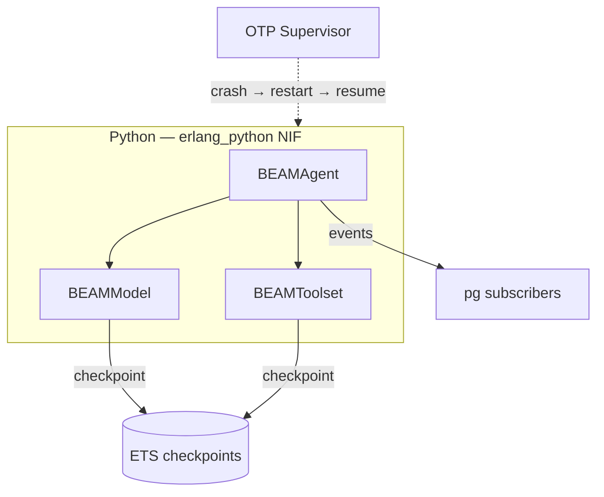

# Durable Execution with BEAM

[BEAM](https://www.erlang.org/) is the virtual machine that runs Erlang (and Elixir). Using [`erlang_python`](https://github.com/benoitc/erlang-python), Python runs **in-process** inside BEAM workers, giving Pydantic AI agents access to OTP supervision, checkpointing, and distribution with zero external dependencies.

A few BEAM-specific terms used throughout this page:

| Term | Meaning |
|---|---|
| **OTP** | Open Telecom Platform — Erlang's standard library of patterns for building fault-tolerant systems (supervisors, GenServers, etc.) |
| **ETS** | Erlang Term Storage — an in-memory key-value store built into the BEAM, used here for checkpoints |
| **pg** | Process Groups — an OTP module for pub/sub between Erlang/Elixir processes (not PostgreSQL 😉) |
| **NIF** | Native Implemented Function — BEAM's FFI, similar to Python C extensions or Rust bindings via PyO3. `erlang_python` uses one to embed a Python interpreter directly in the BEAM process |
| **GenServer** | Generic Server — an OTP behaviour for stateful processes with a standard call/cast interface |

## Durable Execution

`BEAMAgent` makes your agent **durable** by checkpointing model requests and tool calls to ETS. If the BEAM process crashes, the OTP supervisor restarts it and the agent automatically resumes from the last completed step.

* **Workflows** wrap the full agent run. On crash, the supervisor restarts the process and replays from checkpoints.
* **Steps** wrap individual model requests and tool calls. Each step's result is checkpointed to ETS before continuing.

Every step output is stored in ETS via `erlang_python`'s built-in shared state API. When a workflow is replayed after a crash, completed steps return their cached results and execution resumes from the first incomplete step.



See the [`erlang_python` documentation](https://github.com/benoitc/erlang-python) for more information.

## Durable Agent

Any agent can be wrapped in a [`BEAMAgent`][pydantic_ai.durable_exec.beam.BEAMAgent] to get durable execution. `BEAMAgent` automatically:

* Wraps [`Agent.run()`][pydantic_ai.agent.Agent.run] and [`Agent.run_sync()`][pydantic_ai.agent.Agent.run_sync] as BEAM workflows with ETS checkpointing.
* Wraps [model requests](../models/overview.md), [tool calls](../tools.md), and [MCP communication](../mcp/client.md) as checkpointed steps.

The original agent can still be used as normal outside a BEAM worker. When running outside BEAM (e.g. during development or testing), `BEAMAgent` delegates directly to the underlying agent with no overhead.

Here is a simple but complete example of wrapping an agent for durable execution. It requires an Erlang/OTP project with `erlang_python` (see [Erlang setup](#erlang-setup) below) and Pydantic AI installed with the BEAM optional group:

```bash
pip/uv-add pydantic-ai[beam]
```

Or with the slim package:

```bash
pip/uv-add pydantic-ai-slim[beam]
```

!!! note

    There is no PyPI dependency for the BEAM integration -- the `erlang` module is injected at runtime by `erlang_python`. The optional group exists so `pip install pydantic-ai[beam]` works consistently with other integrations.

```python {title="let_it_crash.py" test="skip"}
import asyncio

from pydantic_ai import Agent
from pydantic_ai.durable_exec.beam import BEAMAgent

agent = Agent(
    'openai:gpt-5.2',
    instructions="You're an expert in distributed systems and fault-tolerant architectures.",
    name='let_it_crash',  # (4)!
)

beam_agent = BEAMAgent(agent)  # (1)!


def run_agent(prompt: str) -> str:  # (3)!
    result = asyncio.run(beam_agent.run(prompt))  # (2)!
    return result.output
```

1. Wrapping the agent enables durable execution when running inside a BEAM worker.
2. [`BEAMAgent.run()`][pydantic_ai.durable_exec.beam.BEAMAgent.run] works like [`Agent.run()`][pydantic_ai.agent.Agent.run], but checkpoints model requests and tool calls to ETS.
3. This function is called from BEAM via `py:call` (Erlang) or `:py.call` (Elixir).
4. The agent's `name` is used to uniquely identify its workflows.

Then from BEAM:

=== "Elixir"

    ```elixir
    {:ok, result} = :py.call(:my_agent_module, :run_agent, ["How do BEAM processes achieve fault tolerance?"])
    ```

=== "Erlang"

    ```erlang
    {ok, Result} = py:call(my_agent_module, run_agent, [<<"How do BEAM processes achieve fault tolerance?">>]).
    ```

## BEAM Integration Considerations

There are a few considerations specific to agents and toolsets when using BEAM for durable execution. These are important to understand to ensure that your agents and toolsets work correctly with BEAM's checkpoint and replay model.

### Agent Names and Toolset IDs

To ensure that BEAM can correctly resume workflows after a crash, each agent instance must have a unique [`name`][pydantic_ai.agent.AbstractAgent.name] and each toolset must have a unique [`id`][pydantic_ai.toolsets.AbstractToolset.id]. These fields are normally optional, but are required to be set when using BEAM. They should not be changed once the durable agent has been deployed to production as this would break active workflows.

When `BEAMAgent` dynamically wraps the agent's model requests and toolsets (specifically those that implement their own tool listing and calling, i.e. [`FunctionToolset`][pydantic_ai.toolsets.FunctionToolset] and [`MCPServer`][pydantic_ai.mcp.MCPServer]), their checkpoint keys are derived from the agent's name and the toolset IDs.

All tool calls and MCP communication are automatically checkpointed. Event stream handlers are also wrapped to push events to Erlang subscribers.

Other than that, any agent and toolset will just work!

### Agent Run Context and Dependencies

BEAM checkpoints step outputs to ETS using JSON serialization. This means tool return values must be JSON-serializable. Model responses are serialized via Pydantic's [`TypeAdapter`](https://docs.pydantic.dev/latest/api/type_adapter/).

### Streaming

Since BEAM runs Python in-process, [`BEAMAgent.run_stream()`][pydantic_ai.durable_exec.beam.BEAMAgent.run_stream] supports real-time token streaming inside BEAM workflows. Model tokens are passed through to the caller as they arrive, and the complete response is checkpointed to ETS after the stream finishes. On replay after a crash, completed streaming steps return their cached results instantly.

[`Agent.run_stream_events()`][pydantic_ai.agent.Agent.run_stream_events] is not supported inside a BEAM workflow. Use [`run_stream()`][pydantic_ai.durable_exec.beam.BEAMAgent.run_stream] instead, or set an [`event_stream_handler`][pydantic_ai.agent.EventStreamHandler] on the agent and use [`BEAMAgent.run()`][pydantic_ai.durable_exec.beam.BEAMAgent.run]. The event stream handler function will receive the agent [run context][pydantic_ai.tools.RunContext] and an async iterable of events from the model's streaming response and the agent's execution of tools. For examples, see the [streaming docs](../agent.md#streaming-all-events).

Each event is automatically pushed to pg subscribers, allowing Erlang processes to consume the stream in real time:

```python {title="live_view.py" test="skip"}
from collections.abc import AsyncIterable

from pydantic_ai import Agent
from pydantic_ai.agent import AgentStreamEvent
from pydantic_ai.durable_exec.beam import BEAMAgent
from pydantic_ai.tools import RunContext


async def stream_to_erlang(
    ctx: RunContext[None],
    events: AsyncIterable[AgentStreamEvent],
) -> None:
    async for event in events:
        pass  # Events are published to pg subscribers automatically


agent = Agent(
    'openai:gpt-5.2',
    name='live_view',
    event_stream_handler=stream_to_erlang,
)

beam_agent = BEAMAgent(agent)
```

On the BEAM side, subscribe to workflow events via `pg:join`:

=== "Elixir"

    ```elixir
    :pg.join(:beam_workflows, workflow_id, self())

    # In your GenServer handle_info
    def handle_info({:beam_event, _workflow_id, event_data}, state) do
      # Forward to LiveView, WebSocket, log, etc.
      {:noreply, state}
    end
    ```

=== "Erlang"

    ```erlang
    pg:join(beam_workflows, WorkflowId, self()).

    %% In your gen_server handle_info
    handle_info({beam_event, _WorkflowId, EventData}, State) ->
        %% Forward to WebSocket, log, etc.
        {noreply, State}.
    ```

### Parallel Tool Execution

When using `BEAMAgent`, tools are executed in parallel by default. To guarantee deterministic replay, BEAM waits for all parallel tool calls to complete before emitting events in order. It's equivalent to the behavior of [`with agent.parallel_tool_call_execution_mode('parallel_ordered_events')`][pydantic_ai.agent.AbstractAgent.parallel_tool_call_execution_mode].

If you prefer strict ordering, you can configure the agent to run tools sequentially by setting `parallel_execution_mode='sequential'` when initializing the `BEAMAgent`.

## Retries

BEAM relies on OTP's supervision tree for fault tolerance: if a worker process crashes, the supervisor restarts it and the agent automatically resumes from the last checkpointed step. This replaces the need for application-level retry configuration.

On top of OTP's automatic restarts, Pydantic AI and various provider API clients also have their own request retry logic. Enabling these at the same time may cause the request to be retried more often than expected, with improper `Retry-After` handling.

When using BEAM, it's recommended to not use [HTTP Request Retries](../retries.md) and to turn off your provider API client's own retry logic, for example by setting `max_retries=0` on a [custom `OpenAIProvider` API client](../models/openai.md#custom-openai-client).

You can customize restart behavior using the OTP supervisor's `intensity` and `period` settings in your supervision tree configuration.

## Observability with Logfire

Pydantic AI generates telemetry events for each agent run, model request, and tool call. These can be sent to [Pydantic Logfire](../logfire.md) to get a complete picture of what's happening in your application, including inside BEAM workflows.

Since BEAM runs Python in-process, Logfire instrumentation works the same as in any other Python application — configure Logfire as usual and all Pydantic AI spans will be emitted automatically. See the [Logfire documentation](../logfire.md) for setup instructions.

To forward Python `logging` output (including HTTP request logs from provider clients) to Erlang's logger, call `py:configure_logging/1` (or `:py.configure_logging/1` in Elixir) at startup:

=== "Elixir"

    ```elixir
    :py.configure_logging(%{level: :info})
    ```

=== "Erlang"

    ```erlang
    py:configure_logging(#{level => info}).
    ```

This is useful during development to see what the agent and provider client are doing without setting up Logfire.

## Worker Pool Sizing

Each agent run occupies one worker for its duration. The checkpoint callbacks (`beam_ckpt_get`, `beam_ckpt_set`, etc.) are pure ETS operations in Erlang — they don't call back into Python — so no additional workers are consumed per run.

**Minimum pool size**: `max_concurrent_agent_runs`

A starting configuration for 4 concurrent agent runs:

=== "Elixir"

    ```elixir title="config/config.exs"
    config :erlang_python, num_workers: 4
    ```

=== "Erlang"

    ```erlang title="config/sys.config"
    [{erlang_python, [{num_workers, 4}]}].
    ```

## BEAM Setup

`erlang_python` works from both Erlang and Elixir — the `:py` module API is identical, just with different syntax. The examples below show both.

### Dependency

=== "Elixir"

    ```elixir title="mix.exs"
    defp deps do
      [
        {:erlang_python, "~> 1.8"}
      ]
    end
    ```

=== "Erlang"

    ```erlang title="rebar.config"
    {deps, [
        {erlang_python, "~> 1.8"}
    ]}.
    ```

### Worker Pool Configuration

=== "Elixir"

    ```elixir title="config/config.exs"
    config :erlang_python,
      num_workers: 4,
      num_executors: 4
    ```

=== "Erlang"

    ```erlang title="config/sys.config"
    [
        {erlang_python, [
            {num_workers, 4},
            {num_executors, 4}
        ]}
    ].
    ```

### Python Environment Setup

Before calling into Python, each worker needs the venv's site-packages and your application's Python directory on `sys.path`. There are three things to get right:

**Use `site.addsitedir()`, not `sys.path.insert()`** — `site.addsitedir()` processes `.pth` files in the directory, which is required for editable installs (`pip install -e`) and many normal package installs. Plain `sys.path.insert()` skips `.pth` processing and will silently fail to find packages installed this way.

**Use absolute paths** — relative paths resolve against the OS process working directory at the time of the call, which may differ from where your node was launched.

**Pin calls with `py:bind()` / `:py.bind()`** — `erlang_python` routes each call to a worker from the pool. Without binding, path setup and your actual `py:call` may land on different workers and won't share interpreter state.

=== "Elixir"

    ```elixir
    defp setup_python_env do
      cwd = File.cwd!()
      app_dir = Path.join(cwd, "python")  # your Python source dir
      venv_lib = Path.join([cwd, ".venv", "lib"])
      site_packages = find_site_packages(venv_lib)
      Enum.each([app_dir | site_packages], &inject_path/1)
    end

    defp inject_path(path) do
      :py.exec("import site; site.addsitedir('#{path}')")
    end

    defp find_site_packages(venv_lib) do
      case File.ls(venv_lib) do
        {:ok, entries} ->
          entries
          |> Enum.filter(&String.starts_with?(&1, "python"))
          |> Enum.map(&Path.join([venv_lib, &1, "site-packages"]))
          |> Enum.filter(&File.dir?/1)
        _ -> []
      end
    end
    ```

    Then at call sites:

    ```elixir
    def run_agent(prompt) do
      :py.bind()            # pin to one worker
      setup_python_env()    # path setup runs on the same worker
      {:ok, result} = :py.call(:my_module, :run_agent, [prompt])
      :py.unbind()
      result
    end
    ```

=== "Erlang"

    ```erlang
    setup_python_env() ->
        {ok, Cwd} = file:get_cwd(),
        AppDir = filename:join(Cwd, "python"),  %% your Python source dir
        VenvLib = filename:join([Cwd, ".venv", "lib"]),
        SitePackagesDirs = find_site_packages(VenvLib),
        [inject_path(P) || P <- [AppDir | SitePackagesDirs]].

    inject_path(Path) ->
        Code = io_lib:format("import site; site.addsitedir('~s')", [Path]),
        py:exec(list_to_binary(lists:flatten(Code))).

    find_site_packages(VenvLib) ->
        case file:list_dir(VenvLib) of
            {ok, Entries} ->
                [filename:join([VenvLib, E, "site-packages"])
                 || E <- Entries,
                    lists:prefix("python", E),
                    filelib:is_dir(filename:join([VenvLib, E, "site-packages"]))];
            _ -> []
        end.
    ```

    Then at call sites:

    ```erlang
    run_agent(Prompt) ->
        py:bind(),             %% pin to one worker
        setup_python_env(),    %% path setup runs on the same worker
        {ok, Result} = py:call(my_module, run_agent, [Prompt]),
        py:unbind(),
        Result.
    ```

### Application Startup

=== "Elixir"

    ```elixir title="lib/my_app/application.ex"
    def start(_type, _args) do
      children = [
        AgentDurable
      ]
      Supervisor.start_link(children, strategy: :one_for_one)
    end
    ```

=== "Erlang"

    ```erlang
    %% In your application's start/2 callback
    start(_StartType, _StartArgs) ->
        Children = [
            #{id => agent_durable, start => {agent_durable, start_link, []}}
        ],
        {ok, {#{strategy => one_for_one, intensity => 5, period => 10}, Children}}.
    ```

### Reference Companion Module

Checkpoint storage uses `erlang_python`'s built-in shared state API (`state_set`/`state_get` in Python, `py:state_store`/`py:state_fetch` in Erlang). The companion module below registers functions for event publishing and workflow lifecycle:

| Python calls | Registered function | Purpose |
|---|---|---|
| `erlang.call('beam_event_publish', wf_id, data)` | `event_publish/2` | Push event to pg subscribers |
| `erlang.call('beam_workflow_start', wf_id, name)` | `workflow_start/2` | Register workflow |
| `erlang.call('beam_workflow_complete', wf_id)` | `workflow_complete/1` | Mark done, clean up |

=== "Elixir"

    ```elixir title="lib/my_app/agent_durable.ex"
    defmodule AgentDurable do
      use GenServer

      def start_link(opts \\ []), do: GenServer.start_link(__MODULE__, opts, name: __MODULE__)

      def init(_opts) do
        :ets.new(:beam_workflows, [:named_table, :set, :public, read_concurrency: true])
        :py.register_function(:beam_workflow_start, __MODULE__, :workflow_start)
        :py.register_function(:beam_workflow_complete, __MODULE__, :workflow_complete)
        :py.register_function(:beam_event_publish, __MODULE__, :event_publish)
        {:ok, %{}}
      end

      def workflow_start([workflow_id, agent_name]) do
        :ets.insert(:beam_workflows, {workflow_id, agent_name, :running, :erlang.system_time(:second)})
        :pg.join(:beam_workflows, workflow_id, self())
        :ok
      end

      def workflow_complete([workflow_id]) do
        :ets.insert(:beam_workflows, {workflow_id, nil, :completed, :erlang.system_time(:second)})
        cleanup_checkpoints(workflow_id)
        :pg.leave(:beam_workflows, workflow_id, self())
        :ok
      end

      def event_publish([workflow_id, event_data]) do
        :pg.get_members(:beam_workflows, workflow_id)
        |> Enum.each(&send(&1, {:beam_event, workflow_id, event_data}))
        :ok
      end

      defp cleanup_checkpoints(workflow_id) do
        prefix = "beam_ckpt:" <> (:erlang.term_to_binary(workflow_id) |> Base.encode64()) <> ":"
        :py.state_keys()
        |> Enum.filter(&String.starts_with?(&1, prefix))
        |> Enum.each(&:py.state_delete/1)
      end

      def handle_call(_request, _from, state), do: {:reply, :ok, state}
      def handle_cast(_msg, state), do: {:noreply, state}
      def handle_info(_info, state), do: {:noreply, state}
    end
    ```

=== "Erlang"

    ```erlang title="src/agent_durable.erl"
    -module(agent_durable).
    -behaviour(gen_server).

    -export([start_link/0, start_link/1]).
    -export([init/1, handle_call/3, handle_cast/2, handle_info/2]).
    -export([workflow_start/2, workflow_complete/1, event_publish/2]).

    start_link() ->
        start_link([]).

    start_link(Opts) ->
        gen_server:start_link({local, ?MODULE}, ?MODULE, Opts, []).

    init(_Opts) ->
        ets:new(beam_workflows, [named_table, set, public, {read_concurrency, true}]),
        py:register_function(beam_workflow_start, ?MODULE, workflow_start),
        py:register_function(beam_workflow_complete, ?MODULE, workflow_complete),
        py:register_function(beam_event_publish, ?MODULE, event_publish),
        {ok, #{}}.

    workflow_start(WorkflowId, AgentName) ->
        ets:insert(beam_workflows, {WorkflowId, AgentName, running, erlang:system_time(second)}),
        pg:join(beam_workflows, WorkflowId, self()),
        ok.

    workflow_complete(WorkflowId) ->
        ets:insert(beam_workflows, {WorkflowId, undefined, completed, erlang:system_time(second)}),
        cleanup_checkpoints(WorkflowId),
        pg:leave(beam_workflows, WorkflowId, self()),
        ok.

    event_publish(WorkflowId, EventData) ->
        lists:foreach(fun(Pid) ->
            Pid ! {beam_event, WorkflowId, EventData}
        end, pg:get_members(beam_workflows, WorkflowId)),
        ok.

    cleanup_checkpoints(WorkflowId) ->
        Prefix = <<"beam_ckpt:", (erlang:term_to_binary(WorkflowId))/binary, ":">>,
        lists:foreach(fun(Key) ->
            case binary:match(Key, Prefix) of
                {0, _} -> py:state_delete(Key);
                _ -> ok
            end
        end, py:state_keys()).

    handle_call(_Request, _From, State) ->
        {reply, ok, State}.

    handle_cast(_Msg, State) ->
        {noreply, State}.

    handle_info(_Info, State) ->
        {noreply, State}.
    ```
